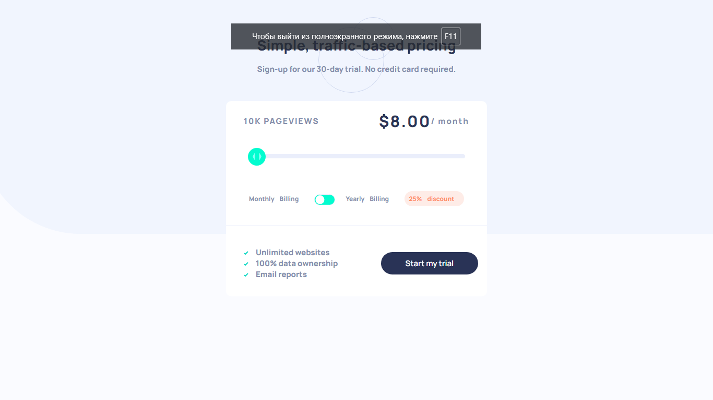

# Frontend Mentor - Interactive pricing component solution

This is a solution to the [Interactive pricing component challenge on Frontend Mentor](https://www.frontendmentor.io/challenges/interactive-pricing-component-t0m8PIyY8). Frontend Mentor challenges help you improve your coding skills by building realistic projects. 

## Overview

### The challenge

### Screenshot

### Links

- Solution URL: [Netlify](https://64ad9ac5f6fb4224fd645a99--fantastic-taiyaki-abd2b5.netlify.app/)
- Live Site URL: [GitHub](https://github.com/OtabekToshtemirov/interactive-pricing)

## My process

### Built with

- Semantic HTML5 markup
- CSS custom properties
- Flexbox
- [React](https://reactjs.org/) - JS library

### What I learned

I learned how to use React and how to use props and state. I also learned how to use the slider and how to make it interactive. I also learned how to use the toggle button and how to make it interactive. 
## Author

- Website - [Otabek Toshtemirov ](https://www.otabek98.netlify.com)
- Frontend Mentor - [@OtabekToshtemirov](https://www.frontendmentor.io/profile/OtabekToshtemirov)
- Twitter - [@ToshtemirovOta ](https://www.twitter.com/ToshtemirovOta)

